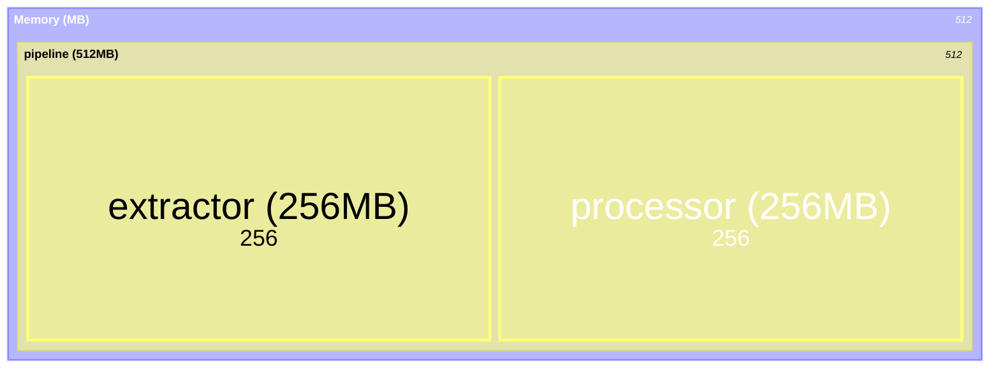

# Reporting Guide

Sleuth provides comprehensive reporting capabilities for metrics visualization and analysis.

## Report Types

### Full Report

Detailed markdown report suitable for GitHub job summaries:

```bash
sleuth report full --save-history --output report.md
```

**Includes:**

- Executive summary with system-level metrics
- Actionable insights with severity levels
- Performance trends with sparklines
- Component performance table
- Mermaid treemap visualizations
- Dependency tree
- Detailed component breakdown

### PR Comment

Concise format optimized for pull request comments:

```bash
sleuth report pr --output pr-comment.md
```

**Includes:**

- System metrics summary
- Insights summary (critical issues first)
- Comparison with previous run
- Collapsible component breakdown

## Using the CLI

### Basic Commands

```bash
# Generate full report to stdout
sleuth report full

# Save to file
sleuth report full --output ./reports/metrics.md

# Save historical snapshot
sleuth report full --save-history

# Specify custom directories
sleuth --results-dir ./my-results --history-dir ./my-history report full
```

### Available Commands

| Command                  | Description                |
| ------------------------ | -------------------------- |
| `sleuth report full`     | Generate detailed report   |
| `sleuth report pr`       | Generate PR comment format |
| `sleuth report trends`   | Show metric trends         |
| `sleuth report compare`  | Compare between runs       |
| `sleuth report insights` | Generate insights only     |
| `sleuth report generate` | Generate basic report      |

### Command Options

```bash
# Full report options
sleuth report full [OPTIONS]
  --output, -o FILE     Output file path
  --save-history        Save snapshot to history

# PR comment options
sleuth report pr [OPTIONS]
  --output, -o FILE     Output file path

# Trends options
sleuth report trends [OPTIONS]
  --metric, -m NAME     Metric name to track (required)
  --last, -n COUNT      Number of runs to show (default: 10)

# Compare options
sleuth report compare [OPTIONS]
  --baseline, -b REF    Baseline commit/branch
  --current, -c REF     Current commit/branch
```

## Using the Python API

### MetricsReporter Class

```python
from sleuth.reporting import MetricsReporter
from pathlib import Path

reporter = MetricsReporter(
    results_dir=Path("./tests/results"),
    history_dir=Path("./tests/history"),
    git_hash="abc1234",  # Optional, auto-detected
)

# Generate full report
full_report = reporter.generate_full_report()

# Generate PR comment
pr_comment = reporter.generate_pr_comment()

# Save historical snapshot
reporter.save_historical_snapshot()
```

### Programmatic Report Generation

```python
from sleuth.reporting import (
    generate_heartbeat,
    aggregate_results,
    MetricsReporter,
)

# Load results
results = load_test_results()

# Generate heartbeat
heartbeat = generate_heartbeat(results)
heartbeat.save("./results/system_heartbeat.json")

# Generate report
reporter = MetricsReporter(
    results_dir=Path("./results"),
    history_dir=Path("./history"),
)
print(reporter.generate_full_report())
```

## Insights System

Sleuth automatically analyzes metrics and generates actionable insights.

### Insight Severity Levels

| Severity | Icon | Description                |
| -------- | ---- | -------------------------- |
| Critical | 🔴   | Immediate action required  |
| High     | 🟠   | Important issue to address |
| Medium   | 🟡   | Should be reviewed         |
| Low      | 🔵   | Minor issue or suggestion  |

### Built-in Insight Checks

| Check                  | Severity | Condition                |
| ---------------------- | -------- | ------------------------ |
| Accuracy Drop          | Critical | accuracy < 50%           |
| Accuracy Regression    | High     | accuracy decreased > 10% |
| Memory Spike           | High     | memory increased > 50%   |
| Performance Regression | Medium   | runtime increased > 20%  |
| Cost Increase          | Medium   | cost increased > 25%     |

### Using InsightGenerator

```python
from sleuth.reporting import InsightGenerator, SystemHeartbeat

# Create heartbeat from metrics
heartbeat = SystemHeartbeat(
    timestamp=time.time(),
    metrics={"accuracy": 0.45, "runtime_ms": 5000},
    system_metrics={"accuracy": 0.45, "error_rate": 0.1},
    component_count=4,
)

# Generate insights
generator = InsightGenerator(
    heartbeat=heartbeat,
    history=[...],  # Previous runs
    hierarchical_report=[...],  # Component hierarchy
)

insights = generator.analyze()

for insight in insights:
    print(f"{insight.severity}: {insight.title}")
    print(f"  {insight.description}")
    print(f"  Cause: {insight.likely_cause}")
    print(f"  Actions: {insight.suggested_actions}")
```

### Custom Insights

```python
from sleuth.reporting.insights import Insight, Severity

def check_custom_metric(heartbeat, history):
    """Custom insight check."""
    value = heartbeat.system_metrics.get("custom_metric", 1.0)

    if value < 0.5:
        return Insight(
            severity=Severity.HIGH,
            title="Custom Metric Low",
            description=f"Custom metric is at {value:.1%}",
            likely_cause="Something went wrong",
            suggested_actions=[
                "Check the configuration",
                "Review recent changes",
            ],
        )
    return None
```

## Report Sections

### Executive Summary

Shows high-level system metrics:

```markdown
## Executive Summary

**Total Components:** 4

### 🎯 System-Level Metrics

| Metric     | Value  |
| ---------- | ------ |
| accuracy   | 95.0%  |
| error_rate | 0.0%   |
| runtime_ms | 2.5s   |
| memory_mb  | 512 MB |
```

### Performance Trends

Shows sparkline visualization of metrics over time:

```markdown
## Performance Trends (Last 10 Commits)

| System Metric | Trend    | Current |
| ------------- | -------- | ------- |
| accuracy      | ▁▂▃▄▅▆▇█ | 95.0%   |
| runtime_ms    | ▆▅▄▃▂▁▁▁ | 2.5s    |
| memory_mb     | ▄▄▄▄▄▅▅▆ | 512 MB  |
```

### Resource Treemaps

Mermaid treemap visualizations:

````markdown
### Memory Distribution


````

````

### Dependency Tree

ASCII tree showing component hierarchy:

```markdown
## Dependency Tree

````

pipeline (2.5s, 95.0%)
├── extractor (1.0s, 97.0%)
└── processor (1.5s, 93.0%)
├── validator (0.5s, 100.0%)
└── formatter (1.0s, 90.0%)

```

```

## Historical Tracking

### Saving History

```bash
# Via CLI
sleuth report full --save-history

# Via Python
reporter.save_historical_snapshot()
```

### History Files

```
tests/history/
├── metrics_history.jsonl      # JSONL of all runs
├── system_heartbeat.abc1234.json
├── system_heartbeat.def5678.json
├── hierarchical_report.abc1234.json
└── hierarchical_report.def5678.json
```

### Loading History

```python
# MetricsReporter loads automatically
reporter = MetricsReporter(history_dir=Path("./history"))
history = reporter._load_history(limit=10)

# Or manually
import json
from pathlib import Path

history = []
history_file = Path("./history/metrics_history.jsonl")
with open(history_file) as f:
    for line in f:
        history.append(json.loads(line))
```

## Aggregation

### System-Level Aggregation

Metrics are aggregated to system level based on category:

```python
from sleuth.reporting import aggregate_by_system_metrics

# Component metrics
components = {
    "extractor": {"accuracy": 0.97, "runtime_ms": 1000},
    "processor": {"accuracy": 0.93, "runtime_ms": 1500},
}

# Aggregate to system level
system_metrics = aggregate_by_system_metrics(components)
# Result: {"accuracy": 0.95, "runtime_ms": 2500}
```

### Custom Aggregation

```python
from sleuth.reporting import aggregate_values
from sleuth.core.types import AggregationType

values = [0.9, 0.95, 0.85]

avg = aggregate_values(values, AggregationType.AVERAGE)  # 0.9
total = aggregate_values(values, AggregationType.SUM)    # 2.7
maximum = aggregate_values(values, AggregationType.MAX)  # 0.95
```

## Best Practices

### 1. Save History on Every CI Run

```yaml
# GitHub Actions
- name: Generate Report
  run: |
    sleuth report full --save-history --output report.md
```

### 2. Use PR Comments for Visibility

```yaml
- name: Generate PR Comment
  if: github.event_name == 'pull_request'
  run: |
    sleuth report pr --output pr-comment.md
```

### 3. Archive Historical Data

```yaml
- name: Upload History
  uses: actions/upload-artifact@v4
  with:
    name: metrics-history
    path: tests/history/
    retention-days: 90
```

### 4. Set Appropriate Thresholds

```python
# Custom insight thresholds
generator = InsightGenerator(
    heartbeat=heartbeat,
    thresholds={
        "accuracy_critical": 0.6,  # Default: 0.5
        "memory_spike": 0.3,       # Default: 0.5
    },
)
```

## Next Steps

- [GitHub Actions Guide](github-actions.md) - Complete CI/CD setup
- [Metrics Guide](metrics.md) - Available metrics
- [API Reference](api.md) - Complete API documentation
